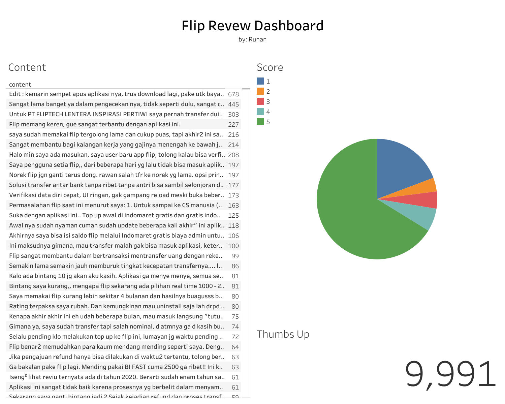
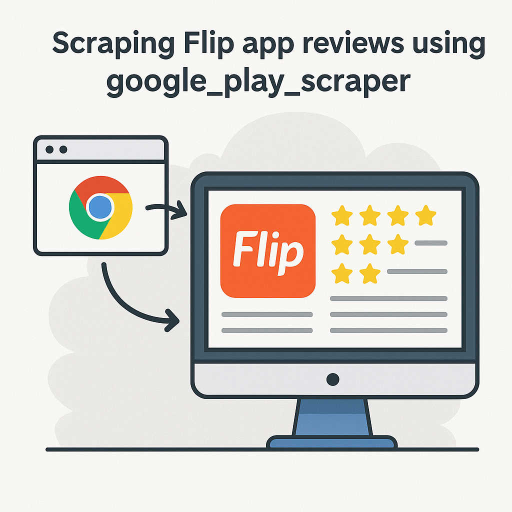
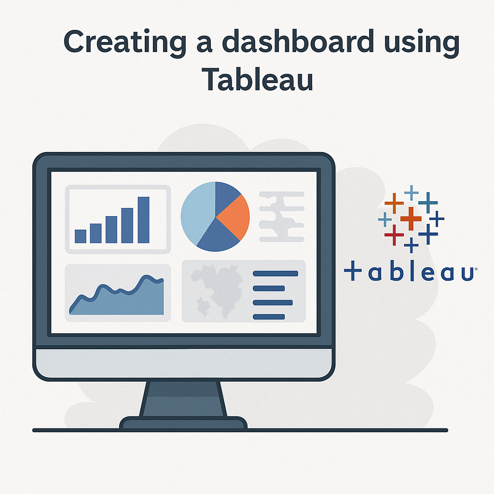
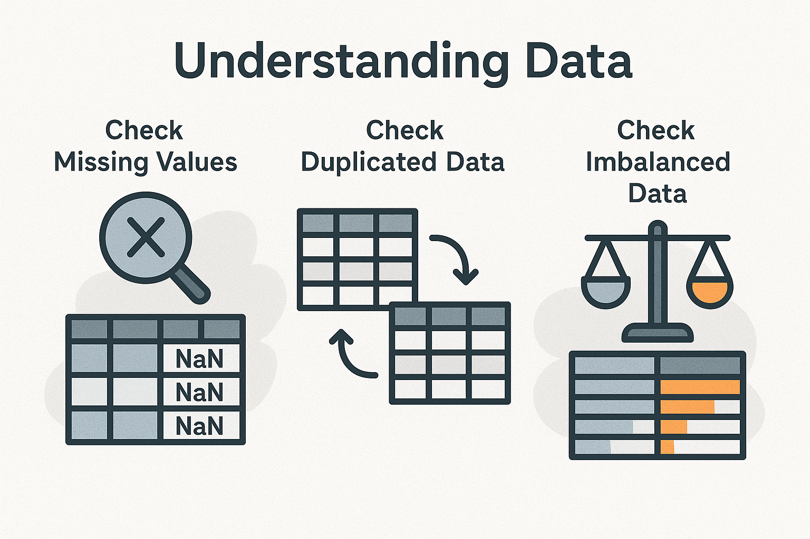
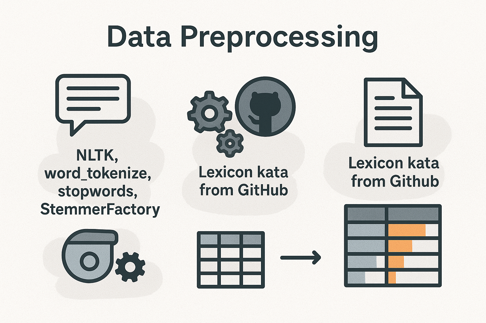
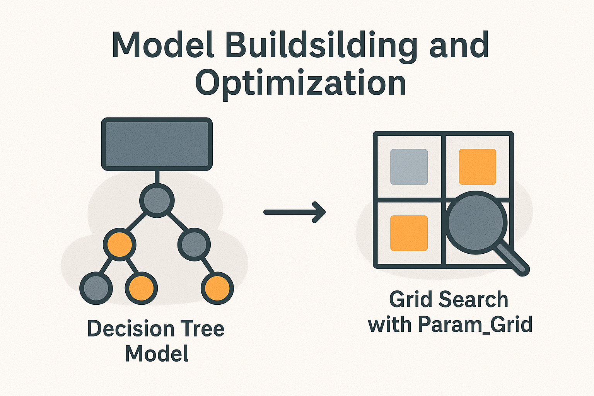

# Flip Review Analysis
by: ruhanmasykuri@gmail.com

[Notebook] [Dashboard]

## Business Understanding
Flip is a financial app that allows users to make interbank transfers without admin fees, as well as providing various other features such as bill payments and digital product purchases. Flip was founded by three Indonesians: Rafi Putra Arriyan, Luqman Sungkar, and Ginanjar Ibnu Solihin. They founded Flip out of concern about the high interbank transfer fees at the time.
Here are some key points about Flip:
- Free interbank transfers: Flip facilitates interbank transfers without admin fees, for both domestic and international transfers.
- Other features: In addition to free transfers, Flip also provides features for bill payments, mobile phone credit purchases, e-wallet top-ups, and other transactions.
- Security: Flip has obtained a permit from Bank Indonesia and implements various security systems to protect user data, according to Wikipedia.
- History: Flip was founded in 2016 by three University of Indonesia alumni and began out of concern about high interbank transfer fees, according to Flip.id.
- Flip Globe: Flip also has a Flip Globe feature for international money transfers.
- Flip Invoice: This feature helps users create and send invoices.
- Flip Deals: Flip Deals offers various attractive offers for users.

### Business Problem

#### Here are the business problems to be solved:
- What are flip.id's user ratings on Google Play?
- Are there any rating points with a high thumbsup count?
- Create a machine learning model that can predict user sentiment from review content.


### Project Scope
This project includes the creation of an interactive dashboard and review sentiment detection using a machine learning model.

### Preparation
This project uses Google Play data scraping for flip.id app reviews. Scraping can be done by running the following code:
```sh
!pip install google-play-scraper

from google_play_scraper import Sort, reviews
import pandas as pd

app_id = 'id.flip'

result, _ = reviews(
    app_id,
    lang='id',
    country='id',
    sort=Sort.NEWEST,
    count=10000,
    filter_score_with=None
)

df = pd.DataFrame(result)

df.to_csv('flip_review.csv', index=False)
```

The scraped data frame has the following features:

| Column name | Description |
| --- | --- |
| reviewId | review identifcation |
| userName | username of user |
| userImage | link of user image |
| content | content of review |
| score | score of review |
| thumbsUpCount | number of thumbs up to the review |
| reviewCreatedVersion | version of application that used by user |
| at | time of posting the review |
| replyContent | reply to the review content |
| repliedAt | time of reply the review |
| appVersion | curent application version |


## Business [Dashboard]


The dashboard can be accessed using the following link: https://public.tableau.com/views/FlipReview/Dashboard1?:language=en-US&:sid=&:display_count=n&:origin=viz_share_link&:device=desktop

## Machine Learning Process






## Conclusion
- Users can use the interactive dashboard to perform in-depth analysis of app user reviews.
- The resulting machine learning model has an F1 score of 91%, which is sufficient for predicting sentiment from app reviews.

[Notebook]:<https://github.com/hanru789/flip_review_sentiment/blob/main/review_Sentiment_notebook.ipynb>
[Dashboard]:<https://public.tableau.com/views/FlipReview/Dashboard1?:language=en-US&:sid=&:display_count=n&:origin=viz_share_link&:device=desktop>
